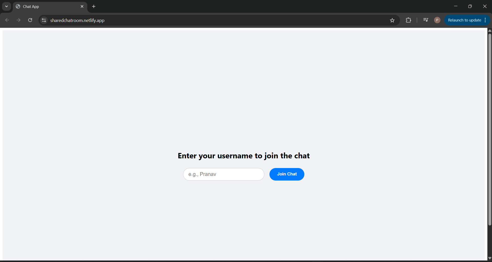
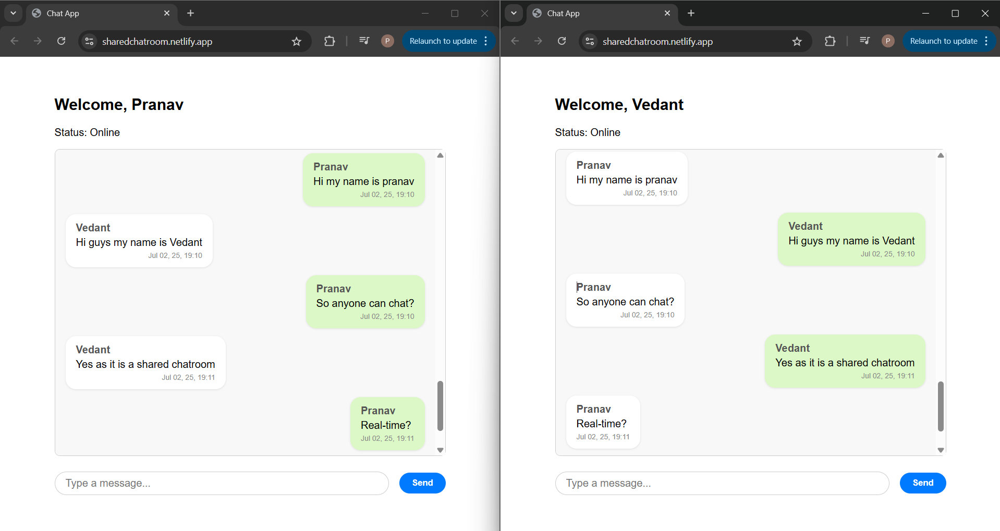

# SharedChatRoom – Real-Time Chat App

A full-stack real-time chat web application built with React on the frontend and Node.js + WebSocket + MongoDB on the backend. 
It supports multiple concurrent users, stores messages in the database, and reflects messages in real time across all connected clients.
# NOTE: As the backend is hosted on a Free Render Instance, and may sleep after inactivity. If you see "Status: Disconnected" or errors at first, please wait for ~30-60 seconds. The server will automatically wake up, and chat will start working

-- 

# Deployment Links
- **Accesss the App**: [https://sharedchatroom.netlify.app](https://sharedchatroom.netlify.app)
- Frontend(Netlify): [https://sharedchatroom.netlify.app](https://sharedchatroom.netlify.app)
- Backend(Render): [https://chat-backend-c7xe.onrender.com](https://chat-backend-c7xe.onrender.com)

--

# Features
- Real-time messaging
- Message broadcast to all connected users
- Recent History of 50 messages
- No external Libraries used
- Can handle multiple users

--

# Setup Instructions (local)
- prerequisites
  -[Node.js](https://node.js.org/)
  -npm or yarn

Clone the project: https://github.com/pranavsonawane5/Chat-App.git
  Instructions for the backend setup 
- cd backend
- npm install
- node index.js
  Server will run at http://localhost:4000
  
  Instructions for the frontend setup
- cd frontend
- npm install
- npm run dev
  Frontend will run at http://localhost:5173

--

# Architecture Overview
--Frontend--
- Built with React+Vite
- Components:
  - UserPromot - enter username
  - ChatWindow - shows chat history
  - MessageInput - send new messages
- Uses native WebSocket API to connect to the backend
- Listens for incoming messages and updates the chat window dynamically

--Backend--
- Built with Node.js and ws Websocket Library
- Manages:
  -Live user connections
  -In-memory chat history

--

# Concurrency Handling and Frontend-Backend Communication
- Each user connection is handled asynchronously
- Messages are broadcast in real time
- Backend can support multiple concurrent users without blocking
- React and Node communicate using WebSocket Protocol non-traditional HTTP protocol

--

# Assumptions & Design Choices
- No authentication - open username-based login (authentication is a future scope)

  --
  
# Accessing the Deployed App
- Visit:[https://sharedchatroom.netlify.app](https://sharedchatroom.netlify.app)
- Choose a username
- Start Chatting in real-time with others online

--

# Preview

 
